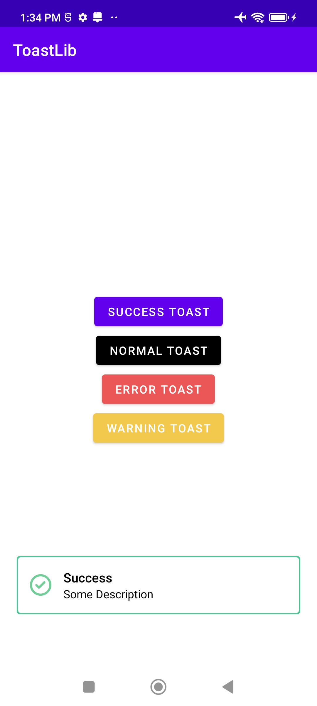

# Android Toastify
Show Android Toast in Singeton design pattern with queue.

## Features
- If multiple same toast are generated simultaneously, all toasts will be merged into one. Currently all the toasts shows one after another, creating bad UX.
- If multiple different toasts are generated, it will be displaced in a queue on after another.

## Step 1
### Gradle

Add to root project gradle
```groovy
allprojects {
    repositories {
        maven {
            url "https://jitpack.io"
        }
    }
}
```

Add dependency to app gradle
```groovy
implementation 'com.github.collegeduniadevelopers:Toastify:Tag'
```

## Step 2
Show Toast
```java
ToastGenerate.getInstance(context)
            .createToastMessage(ToastModel(type: ToastType,title: String, message: String?, leftImg: Drawable?, length: ToastLength? = ToastLength.SHORT))
```


### ToastType:
1. **ToastType.SUCCESS**
2. **ToastType.NORMAL**
3. **ToastType.ERROR**
4. **ToastType.WARNING**

### ToastLength:
1. **ToastLength.SHORT**
2. **ToastLength.LONG**

# Screenshots:
1. Success <br>
2. Normal <br>
3. Error <br>
4. Warning <br>


That's pretty much it. Thanks
